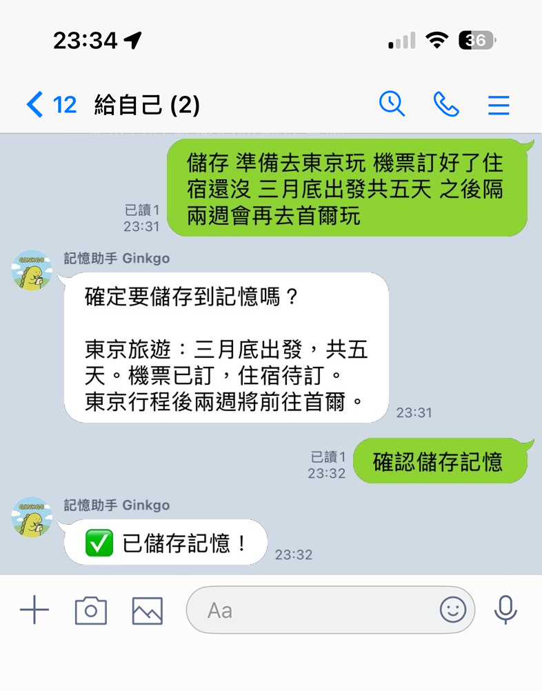
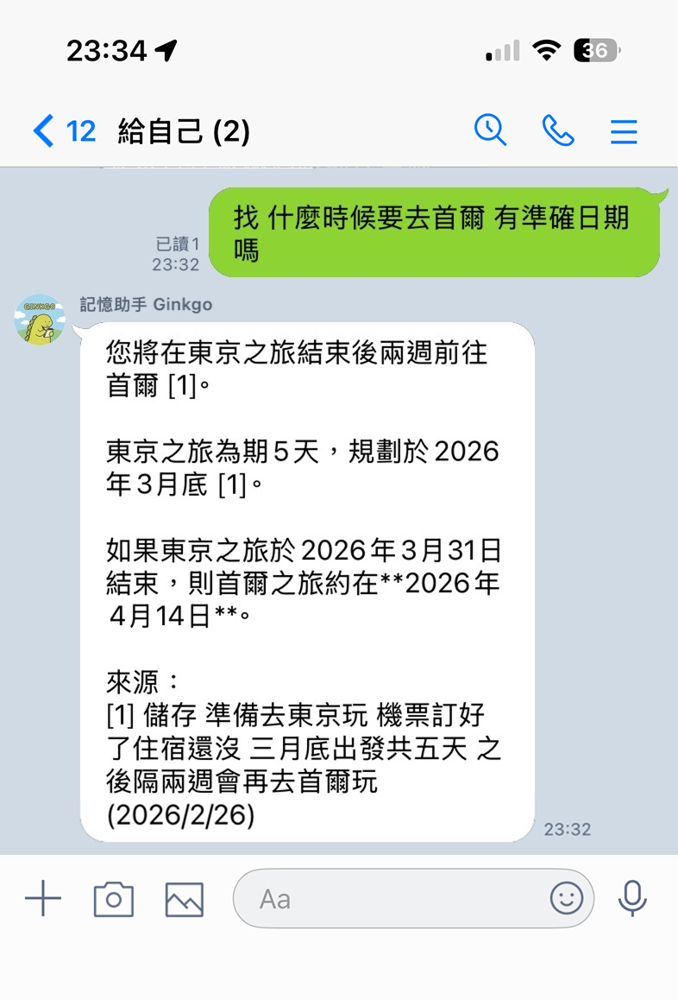
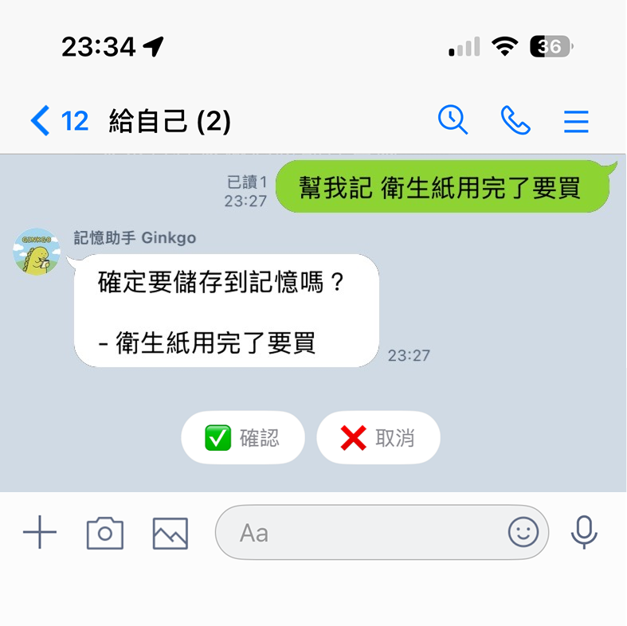
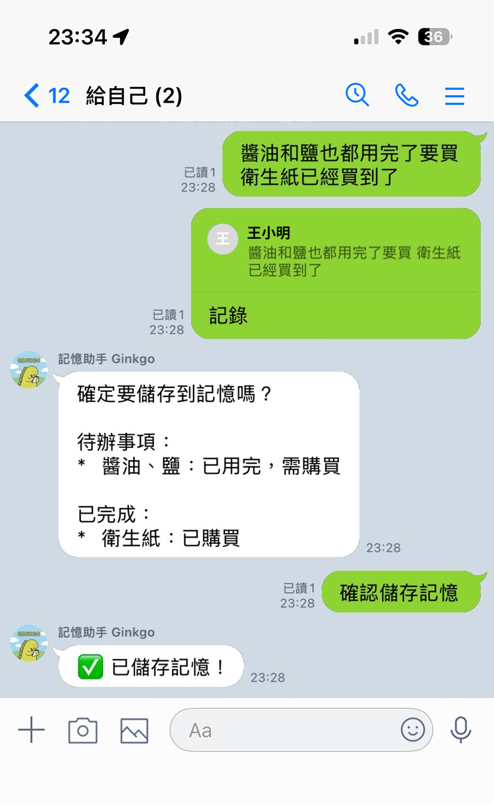
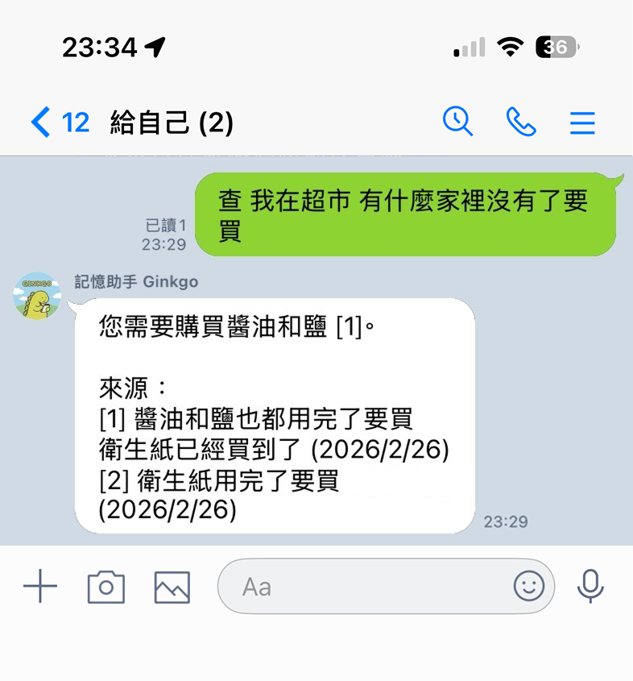

<div align="center">
  
  <h1>LINE Memory Assistant</h1>
  <p>A personal memory assistant bot for LINE groups with automatic storage, semantic search, and long-term memory management.</p>
</div>

## Features

- **Semantic Search**: Upgrade to searchable, structured memories with intelligent retrieval
- **Non-Disruptive**: No auto-reply, only responds to keywords. Add to existing groups without losing history
- **Full Traceability**: All messages auto-saved as raw records for source verification and context retrieval

## Quick Demo

### Example 1: Cross-Message Reasoning with Structured Memory

<div>
  
  
</div>

Timeline:

1. User inputs: _"儲存 準備去東京玩 機票訂好了住宿還沒 三月底出發共五天 之後隔兩週會再去首爾玩"_
2. Bot structures content and shows quick reply buttons for confirmation (left screenshot):  
   _"東京旅遊：三月底出發，共五天。機票已訂，住宿待訂。東京行程後兩週將前往首爾。"_
3. User clicks button → Memory saved
4. Later, user asks: _"我 什麼時候要去首爾 有準確日期嗎"_
5. Bot infers dates (right screenshot): _"您將在東京之旅結束後兩週前往首爾...如果東京之旅於 2026 年 3 月 31 日結束，則首爾之旅約在 2026 年 4 月 14 日。"_

Key capabilities:

- **Temporal reasoning**: Input only said "two weeks later" - bot calculates exact dates across memories
- **Source traceability**: Shows original messages with timestamps for verification

### Example 2: Dynamic Memory Updates with Structured Integration

<div style="display:flex; gap:10px; align-items:flex-start; flex-wrap:nowrap;">
  
  
  
</div>

Timeline:

1. User says: _"幫我記 衛生紙用完了要買"_ → Saved as pending item
2. Bot shows quick reply buttons for easy confirmation (left screenshot)
3. User says: _"醬油和鹽也都用完了要買 衛生紙已經買到了"_ → Memory updated (middle screenshot)
4. User replies to a message with: _"記錄"_ → Captures that specific message
5. User asks: _"查 我在超市 有什麼家裡沒有了要買"_
6. Bot answers: _"您需要購買醬油和鹽"_ (right screenshot, knows toilet paper is done)

Key capabilities:

- **Quick reply buttons**: Easy confirmation without typing commands
- **Memory updates**: New information overwrites outdated items (toilet paper: needed → bought)
- **Structured integration**: Organizes scattered mentions into categorized lists
- **Post-save capture**: Reply to any message to save it later

### Why This Matters

- Understands context, not just keywords
- Merges scattered messages into one clear answer
- Infers dates and timelines from your notes
- Always links back to the original messages

## Commands

| Feature          | Syntax / Condition                  | Keyword                                    |
| ---------------- | ----------------------------------- | ------------------------------------------ |
| 記錄現在這句話   | [keyword] + 內容                    | `幫我記`, `記一下`, `記錄`, `save`, `儲存` |
| 記錄上一則訊息   | [keyword]                           | `存上一則`, `存最後一則`                   |
| 記錄某個說過的話 | 回覆某則訊息 + [keyword]            | `幫我記`, `記一下`, `記錄`, `save`, `儲存` |
| 確認寫入記憶     | [keyword] (或點彈出的 quick button) | `確認儲存記憶`                             |
| 取消寫入記憶     | [keyword] (或點彈出的 quick button) | `取消儲存記憶`                             |
| 查詢記憶         | [keyword] + 問題                    | `查`, `找`, `搜尋`, `search`               |
| 取得使用說明     | [keyword]                           | `help`, `怎麼用`, `幫助`                   |

## Inspiration & Design Approach

Inspired by [Boo-Boo: LINE AI Assistant](https://techblog.lycorp.co.jp/zh-hant/Boo-Boo-LINE-AI-Assistant), adapted with three key principles:

1. **Group Bot, Not Official Account**: Add to existing chats without disruption; keep past notes, albums, and full LINE features
2. **Memory Only, No Todos**: Focus solely on capture and search—no calendars or task management
3. **Minimal Interruption**: No auto-reply; AI only for content cleaning and search, not conversations

## System Architecture

**Layered Design**

```
LINE Webhook
     ↓
Command Parser (rule-based only)
     ↓
Service Layer
  ├─ CaptureService (memory capture)
  ├─ QueryService (search)
  └─ HelpService (help)
     ↓
Provider Layer (swappable)
  ├─ LINEProvider
  ├─ LLMProvider (Gemini)
  ├─ MemoryProvider (mem0)
  └─ StorageProvider (Supabase)
```

**Memory Upgrade Flow**

```
User Message → Save to Raw DB → Parse Command
                                      ↓
              Keyword Triggered → LLM Cleans Content → Create Pending
                                                          ↓
              User Confirms → Write to mem0 → Complete
```

**Query Flow**

```
Query Command → mem0 Semantic Search → LLM Composes Answer → Attach Sources → Reply
```

## Tech Stack

| Layer            | Technology        | Description                          |
| ---------------- | ----------------- | ------------------------------------ |
| Language         | TypeScript        | Type-safe                            |
| Framework        | Next.js 14        | Serverless API Routes                |
| Hosting          | Vercel Hobby      | Free deployment (100 GB/month)       |
| Database         | Supabase Postgres | Free tier (500 MB)                   |
| Long-term Memory | mem0              | Hosted and handled structured memory |
| LLM              | Google Gemini     | Free API quota (60 req/min)          |
| LINE             | @line/bot-sdk     | Official SDK                         |

**Free Tier Quotas**

| Service  | Free Tier Limits                            | How to Check Usage                                                              |
| -------- | ------------------------------------------- | ------------------------------------------------------------------------------- |
| Gemini   | 15 RPM, 1M TPM, 1500 RPD                    | [Google AI Studio - Rate Limits](https://aistudio.google.com/app/plan)          |
| Supabase | 500 MB storage, 5 GB bandwidth/month        | [Supabase Dashboard](https://supabase.com/dashboard/project/_/settings/billing) |
| mem0     | Hobby Plan (check official docs for limits) | [mem0 Dashboard](https://app.mem0.ai/dashboard)                                 |
| Vercel   | 100 GB bandwidth/month (Hobby)              | [Vercel Usage](https://vercel.com/dashboard/usage)                              |
| LINE     | No quota limits when using `replyToken`     | -                                                                               |

## Quick Start

See **[SETUP_GUIDE.md](./SETUP_GUIDE.md)** for complete setup instructions.

## Project Structure

```
line-memory-assistant/
├── app/
│   ├── layout.tsx
│   ├── page.tsx
│   └── api/webhook/route.ts      # LINE webhook endpoint
├── lib/
│   ├── types/index.ts             # TypeScript type definitions
│   ├── constants/                 # Command & message constants
│   │   ├── captureMessages.ts
│   │   ├── commands.ts
│   │   └── queryMessages.ts
│   ├── parsers/
│   │   └── commandParser.ts       # Command parser
│   ├── providers/                 # Swappable third-party wrappers
│   │   ├── lineProvider.ts
│   │   ├── llmProvider.ts
│   │   ├── memoryProvider.ts
│   │   └── storageProvider.ts
│   ├── services/                  # Business logic
│   │   ├── captureService.ts
│   │   ├── queryService.ts
│   │   └── helpService.ts
│   └── utils/                     # Utilities & helpers
│       ├── errorHandler.ts
│       ├── commandUtils.ts
│       └── errorValidator.ts
├── supabase/schema.sql            # Database schema
└── qa/                            # QA tests
    └── QA_TEST_PLAN.md
```

## Database Design

**messages (raw messages)**

```sql
- id: UUID
- user_id: VARCHAR
- group_id: VARCHAR (nullable)
- line_message_id: VARCHAR (unique)
- quoted_message_id: VARCHAR (nullable)
- content: TEXT
- created_at: TIMESTAMP
```

**pending_actions (pending memories)**

```sql
- id: UUID
- user_id: VARCHAR
- group_id: VARCHAR (nullable)
- action_type: VARCHAR (fixed as 'add_memory')
- draft_content: TEXT (LLM-cleaned content)
- raw_id: UUID (FK to messages)
- expires_at: TIMESTAMP (expires after 30 minutes)
- created_at: TIMESTAMP

UNIQUE(user_id, group_id)  -- Each user can only have one pending
```

**mem0 (long-term memory)**

Using mem0 hosted service, metadata includes:

- `raw_id`: Original message ID
- `user_id`: User ID
- `group_id`: Group ID
- `created_at`: Creation timestamp

## References

- [LINE Messaging API Documentation](https://developers.line.biz/en/docs/messaging-api/)
- [mem0 Documentation](https://docs.mem0.ai/)
- [Next.js Documentation](https://nextjs.org/docs)
- [Supabase Documentation](https://supabase.com/docs)
- [Google AI (Gemini) Documentation](https://ai.google.dev/docs)

## Future Features

- [ ] List all memories (Flex Message UI)
- [ ] Delete memories
- [ ] Tag system
- [ ] Batch upgrade Raw → Memory
- [ ] Web Dashboard for querying
- [ ] Memory conflict detection
- [ ] Search result reranking
